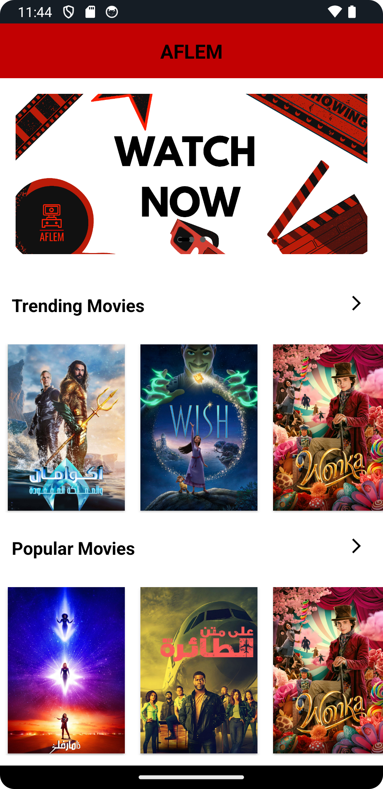
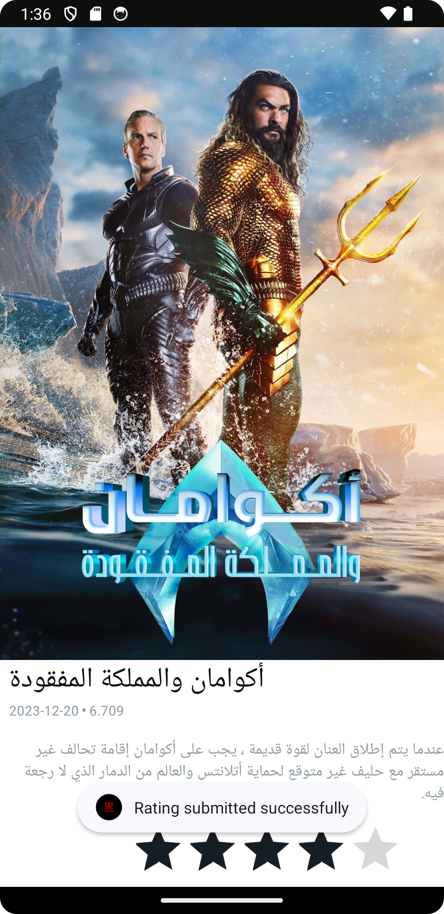
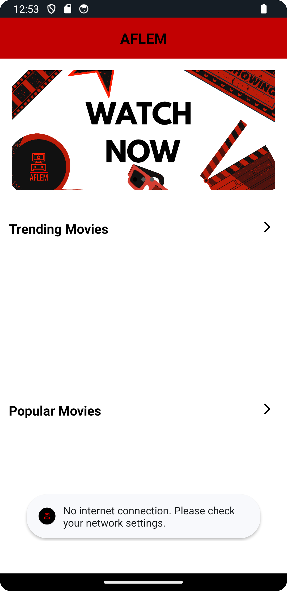

# Aflem - Documentation de l'Application

<p align="center">
  
</p>

## Introduction
Aflem est une application Android conçue pour explorer des informations sur les films et permettre aux utilisateurs de donner leur avis sur les films. Cette documentation explique le fonctionnement de l'application, les fonctionnalités mises en œuvre et les décisions de conception prises.

## Fonctionnalités
### Exploration de Films
Aflem utilise l'API TheMovieDB pour récupérer des informations sur les films, y compris les titres, les descriptions, les affiches et bien plus encore. Les utilisateurs peuvent parcourir la liste des films populaires, des films qui sont diffusés en cinéma actuallement, d'afficher les détails d'un film en particulier, et de noter ce film.

### Évaluation des Films
Les utilisateurs ont la possibilité de donner leur avis sur les films en attribuant une note de 1 à 5 étoiles. Ces évaluations sont enregistrées et peuvent être consultées ultérieurement.

### Session Invité
Aflem génère automatiquement une session invité pour chaque utilisateur au lancement de l'application et est stockée dans les shared preferences. Cette session permet aux utilisateurs de profiter des fonctionnalités de l'application sans avoir besoin de s'authentifier (tel que pouvoir noter des films)

### Gestion des Erreurs de l'API
L'application Aflem gère deux types d'erreurs liées aux calls l'API :
1. Si le réseau n'est pas disponible, l'application affiche un message d'erreur approprié à l'utilisateur.
2. Si la réponse de l'API n'est pas réussie (par exemple, en raison d'une erreur côté serveur), l'application affiche également un message d'erreur informatif.

## Captures d'Écran

<p align="center">
  
</p>
<p align="center">
  <em>Capture d'écran 1 : Page d'accueil</em>
</p>

<p align="center">
  
</p>
<p align="center">
  <em>Capture d'écran 2 : Liste des films populaires</em>
</p>

<p align="center">
  
</p>
<p align="center">
  <em>Capture d'écran 3 : Page de détails d'un film avec une évaluation d'utilisateur</em>
</p>

<p align="center">
  
</p>
<p align="center">
  <em>Capture d'écran 4 : Erreur de connexion</em>
</p>


## Conception de l'Application et Décisions Prises

### Utilisation d'Adapters et RecyclerViews
Dans Aflem, nous avons utilisé le concept d'Adapters et de RecyclerViews pour afficher la liste de films de manière efficace. Les Adapters servent d'intermédiaire entre les données des films et la vue qui les affiche. Les RecyclerViews sont des composants d'interface utilisateur Android qui permettent d'afficher une liste déroulante de manière optimisée, en recyclant les éléments de la liste à mesure qu'ils sont visibles à l'écran. Cela garantit des performances fluides, même avec de grandes listes de films.

Voici un example de comment nous utilisons les Adapters et RecyclerViews dans notre code :

```kotlin
val viewModel = ViewModelProvider(this).get(MainActivityViewModel::class.java)

// Configuration de l'Adapter et du LayoutManager pour afficher les films populaires
viewModel.adapter2 = MovieAdapter(this, viewModel.resultsPopular)
recycler_view_popular_movies.adapter = viewModel.adapter2
val layoutManager2 = LinearLayoutManager(this, LinearLayoutManager.HORIZONTAL, false)
recycler_view_popular_movies.layoutManager = layoutManager2

// Appel à la méthode pour obtenir la liste des films populaires
viewModel.getPopularMovies()
```

### Stockage de la Clé de l'API dans un Fichier .env
Pour garantir la sécurité de la clé de l'API utilisée (par exemple, la clé de l'API TheMovieDB), nous avons pris la décision de stocker cette clé dans un fichier de configuration externe au lieu de la hardcoder directement dans le code source de l'application. Cette approche protège la clé de l'API des fuites accidentelles ou de la compromission de sécurité.

### Utilisation des Intent
Nous utilisons des Intent pour permettre la navigation entre les différentes activités de l'application. Les Intent sont des objets Android qui permettent de démarrer de nouvelles activités, passer des données entre elles et gérer la navigation de manière flexible.

Voici un exemple de l'utilisation des Intent pour lancer une activité lorsqu'un élément est cliqué :

```kotlin
Copy code
cl_popular_movies.setOnClickListener {
    val intent = Intent(this, MorePopularActivity::class.java)
    startActivity(intent)
}
```

### Architecture MVVM
Nous avons choisi d'implémenter l'architecture MVVM (Modèle-Vue-VueModèle) pour notre application. Cette architecture permet de séparer clairement les responsabilités au sein de l'application. Le Modèle représente les données, la Vue gère l'interface utilisateur, et le VueModèle fait le lien entre les deux en fournissant les données nécessaires à la Vue. Cela rend l'application plus modulaire, facile à tester et à maintenir.

Dans notre code, le ViewModel gère la logique des appels API et des mises à jour des données, tandis que les activités se concentrent sur l'interface utilisateur.

Ces décisions de conception visent à rendre l'application Aflem plus robuste, performante et extensible, tout en offrant une expérience utilisateur fluide.

## Team
* Achref Saidi
* Tasnim Dakhli
* Mahdi Ghorbel
* Ali Doggaz